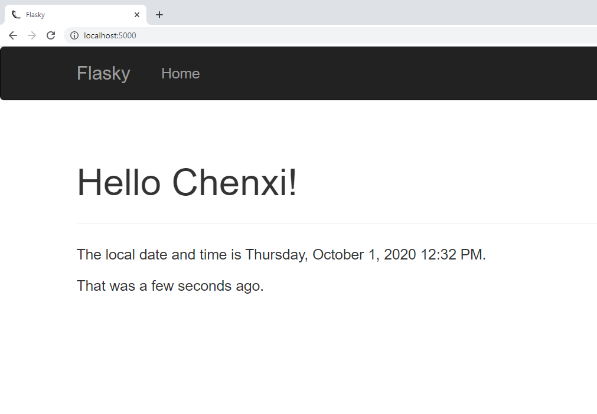
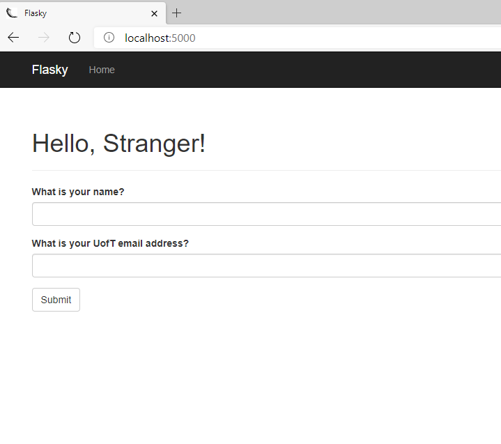
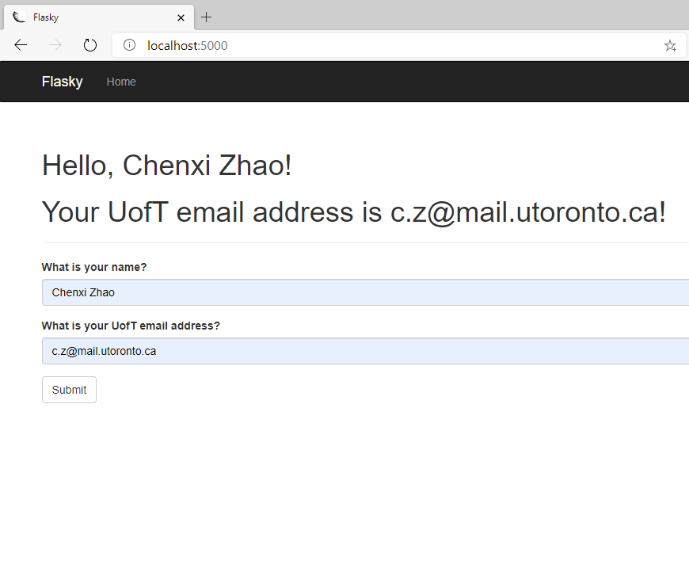
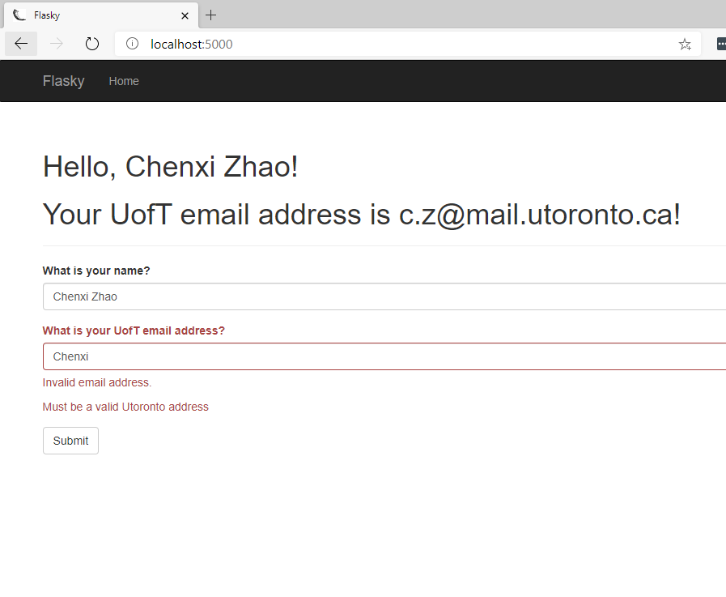

# ECE444-F2020-Lab3

Chenxi Zhao

this repo is a clone of
https://github.com/miguelgrinberg/flasky

Activity 1 \

Activity 2 \

Activity 3 \

SQL vs NoSQL: \
SQL - relational database, fixed schema, vertically scalable \
NoSQL - Non relational, flexible schema, horizontally scalable, better in a distributed setting 
