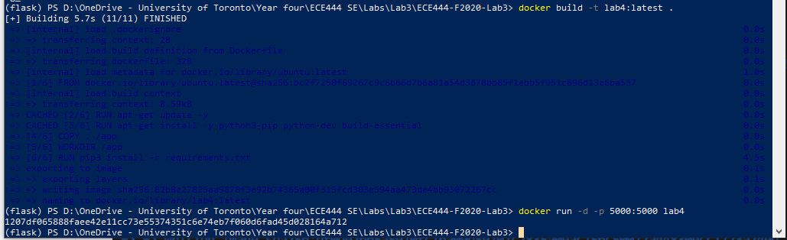
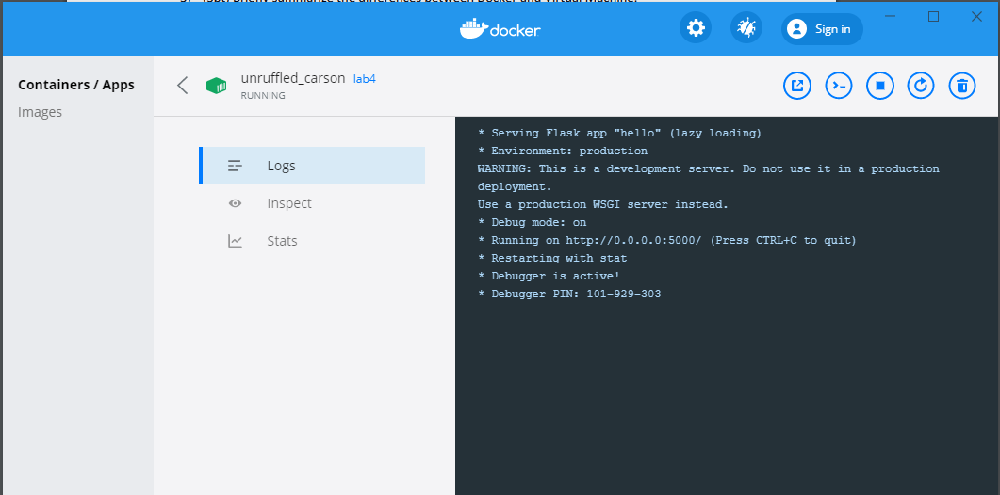
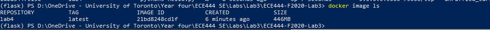

# ECE444-F2020-Lab4

Chenxi Zhao

Docker build and run command \

Docker app log\

Docker status \

Docker image \

Deployed app \

## Docker vs Virtual Machine: \
Docker - container that runs within the user space of the host OS. Shares the host os kernel with other containers.
VM - full operating system that runs with virtualized hardware on top of the host os.